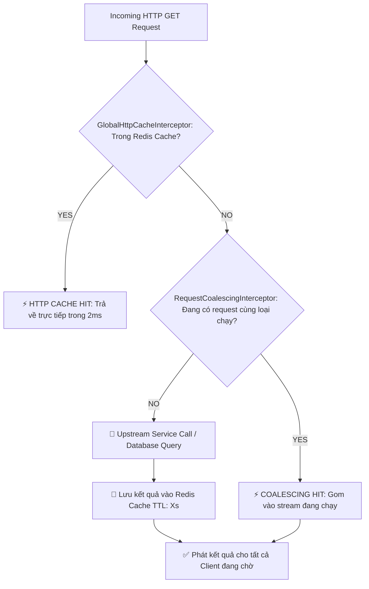

# 📘 Hướng dẫn Triển khai Catalog Service & API Gateway BFF (NestJS 11)

> Tài liệu kỹ thuật chuẩn xác **100% theo mã nguồn thực tế** của hệ thống QuickBite:
> - **Catalog Service:** `NestJS 11`, `TypeORM 1.1`, `PostgreSQL (JSONB/Array)`, `KafkaJS 2.2`, `JWKS Auth` (Port 3000)
> - **API Gateway (BFF):** `NestJS 11`, `Redis 6 Cache`, `MongoDB Dynamic Config`, `@nestjs/throttler 6.5`, `JWKS Edge Guard` (Port 3001)
> - **Notification Service:** *Trạng thái quy hoạch* — Đã dành riêng Kafka Topic `notification-events`, chưa triển khai service riêng trong source code hiện tại.

---

## 📑 Mục lục

1. [Cấu trúc Thư mục & Modules](#1-cấu-trúc-thư-mục--modules)
2. [Catalog Service (NestJS 11 / PostgreSQL / TypeORM)](#2-catalog-service-nestjs-11--postgresql--typeorm)
3. [API Gateway / BFF (NestJS 11 / Dynamic Config / Redis / Mongo)](#3-api-gateway--bff-nestjs-11--dynamic-config--redis--mongo)
4. [Tích hợp Kafka & Event Streaming](#4-tích-hợp-kafka--event-streaming)
5. [Cơ chế Xác thực Tập trung với JWKS](#5-cơ-chế-xác-thực-tập-trung-với-jwks)
6. [Quy hoạch Notification Service (Future Roadmap)](#6-quy-hoạch-notification-service-future-roadmap)
7. [Dependencies & npm Packages thực tế](#7-dependencies--npm-packages-thực-tế)

---

## 1. Cấu trúc Thư mục & Modules

```
src/
├── quick-bite-catalog/                  # Catalog Service (Port 3000)
│   └── src/
│       ├── restaurant/                  # Quản lý nhà hàng & thông tin địa chỉ GPS
│       ├── category/                    # Danh mục món ăn theo nhà hàng
│       ├── food-item/                   # Món ăn, biến thể (variants), toppings (JSONB)
│       ├── request/                     # Generic Request Center (Duyệt đối tác, báo cáo món)
│       ├── review/                      # Đánh giá món ăn & nhà hàng (Unique per order item)
│       ├── auth/                        # JWKS-RSA Passport Strategy & Roles Guards
│       ├── common/                      # Response Envelopes, Exception Filters, DTOs
│       └── health/                      # Health Check Endpoint
│
└── quick-bite-api-gateway/              # API Gateway & BFF (Port 3001)
    └── src/
        ├── auth/                        # Edge JWT Token Guard & Role Checking
        ├── proxy/                       # Reverse Proxy chuyển tiếp request tới microservices
        ├── admin/                       # Admin BFF Service (Gom dữ liệu thống kê tổng hợp)
        ├── merchant/                    # Merchant BFF Service (Gom dữ liệu POS/Dashboard)
        ├── cache/                       # Redis Cache Service (ioredis)
        ├── config/                      # 3-tier Dynamic Config Engine (Redis -> MongoDB -> .env)
        ├── health/                      # Health Aggregation & Cold-start Wake-up Trigger
        └── common/                      # Rate Limiting (@nestjs/throttler), Logging
```

---

## 2. Catalog Service (NestJS 11 / PostgreSQL / TypeORM)

### 2.1. Trách nhiệm chính
* Quản lý thông tin nhà hàng (`Restaurant`), phân loại danh mục (`Category`), và thực đơn món ăn (`FoodItem`).
* Lưu trữ biến thể kích thước (`variants`) và lựa chọn topping (`toppings`) bằng trường `jsonb` linh hoạt trong PostgreSQL.
* **Generic Request Center (`catalog_requests`)**: Tiếp nhận và xử lý yêu cầu đăng ký mở quán của đối tác (`RESTAURANT_REGISTRATION`), báo cáo vi phạm (`FOOD_REPORT`), hoặc phản hồi hệ thống (`SYSTEM_FEEDBACK`). Khi Admin phê duyệt, hệ thống kích hoạt ACID Transaction để tự động tạo `Restaurant` mới.
* **Hệ thống đánh giá (`reviews`)**: Quản lý phản hồi khách hàng với Compound Unique Index `(orderId, foodItemId)` chống spam đánh giá trùng lặp.
* Phát Kafka event (`catalog-events`) để Order Service đồng bộ bản sao `FoodItem` phục vụ tính giá checkout.

### 2.2. Công nghệ sử dụng
| Thành phần | Công nghệ thực tế |
| :--- | :--- |
| **Framework** | NestJS 11.0.1 (`@nestjs/core`, `@nestjs/common`) |
| **Database** | **PostgreSQL** (`pg 8.22.0`) |
| **ORM** | TypeORM 1.1.0 (`@nestjs/typeorm`) |
| **Authentication** | Passport JWT + `jwks-rsa 4.1.0` (Verify qua Identity Service JWKS) |
| **Event Bus** | KafkaJS 2.2.4 (`kafkajs`) |
| **Documentation** | Swagger OpenAPI 11 (`@nestjs/swagger`) |

### 2.3. Entities & Cấu trúc Database thực tế

#### 1. `Restaurant` (`restaurants`)
```typescript
@Entity('restaurants')
export class Restaurant {
  @PrimaryGeneratedColumn('uuid') id!: string;
  @Column('uuid') ownerId!: string;
  @Index({ unique: true }) @Column() slug!: string;
  @Column() name!: string;
  @Column('jsonb') address!: {
    line1: string; ward: string; district: string; city: string;
    geo: { type: 'Point'; coordinates: [number, number] };
  };
  @Column({ default: 'closed' }) status!: string; // 'open' | 'closed'
  @Column('jsonb', { default: () => `'{"avg":0,"count":0}'` }) rating!: { avg: number; count: number };
  @CreateDateColumn() createdAt!: Date;
  @UpdateDateColumn() updatedAt!: Date;
  @OneToMany(() => Category, (c) => c.restaurant) categories!: Category[];
}
```

#### 2. `FoodItem` (`food_items`)
```typescript
@Entity('food_items')
@Index('IDX_FOOD_ITEM_SKU', ['sku'], { unique: true })
export class FoodItem {
  @PrimaryGeneratedColumn('uuid') id!: string;
  @Column('uuid') categoryId!: string;
  @Column('uuid') restaurantId!: string;
  @Column({ unique: true }) sku!: string;
  @Column() name!: string;
  @Column({ type: 'text', nullable: true }) description!: string;
  @Column({ type: 'decimal', precision: 10, scale: 2 }) price!: number;
  @Column({ default: 'VND' }) currency!: string;
  @Column('text', { array: true, default: () => "'{}'" }) images!: string[];
  @Column({ default: true }) isAvailable!: boolean;
  @Column({ default: 15 }) preparationTime!: number;
  @Column('text', { array: true, default: () => "'{}'" }) tags!: string[];
  @Column({ default: 0 }) totalSold!: number;
  @Column({ type: 'decimal', precision: 3, scale: 2, default: 0 }) rating!: number;
  @Column({ default: 0 }) reviewCount!: number;
  @Column({ type: 'jsonb', default: () => "'[]'" }) variants!: { name: string; priceDelta: number }[];
  @Column({ type: 'jsonb', default: () => "'[]'" }) toppings!: { name: string; price: number }[];
}
```

#### 3. `CatalogRequest` (`catalog_requests`)
* `id` (`UUID PK`), `userId` (`UUID`), `type` (`RESTAURANT_REGISTRATION | FOOD_REPORT | SYSTEM_FEEDBACK`), `status` (`PENDING | APPROVED | REJECTED`), `payload` (`jsonb`), `adminNote` (`text`), `processedBy` (`UUID`).

#### 4. `Review` (`reviews`)
* `id` (`UUID PK`), `orderId` (`string`), `restaurantId` (`string`), `foodItemId` (`string`), `userId` (`string`), `rating` (`int: 1..5`), `comment` (`text`).
* **Compound Unique Index:** `(orderId, foodItemId)` đảm bảo tính xác thực 1 đánh giá / 1 món / 1 đơn.

### 2.4. Endpoints Catalog Service (Port 3000)
* **Restaurant API:**
  * `GET /restaurants`: Tìm kiếm nhà hàng có phân trang.
  * `POST /restaurants`: Tạo nhà hàng mới (yêu cầu quyền Merchant/Admin).
  * `GET /restaurants/:id`: Chi tiết nhà hàng kèm thực đơn theo danh mục.
  * `PUT /restaurants/:id`: Cập nhật thông tin nhà hàng.
* **Food Items API:**
  * `GET /food-items`: Danh sách món ăn.
  * `POST /food-items`: Thêm món mới kèm variants và toppings.
  * `GET /food-items/:id`: Chi tiết món ăn.
  * `PUT /food-items/:id`: Cập nhật món ăn (tự động publish Kafka sync sang Order Service).
  * `DELETE /food-items/:id`: Xóa món ăn.
* **Category API:**
  * `GET /categories/restaurant/:restaurantId`: Lấy danh mục theo quán.
  * `POST /categories`: Thêm danh mục mới.
* **Request & Review API:**
  * `POST /requests`: Gửi yêu cầu đăng ký mở quán đối tác.
  * `GET /requests`: Danh sách yêu cầu (Dành cho Admin).
  * `PATCH /requests/:id/approve`: Duyệt yêu cầu (Auto-create Restaurant).
  * `POST /reviews`: Gửi đánh giá món ăn sau khi hoàn thành đơn hàng.
  * `GET /reviews/restaurant/:restaurantId`: Đánh giá của nhà hàng.

---

## 3. API Gateway / BFF (NestJS 11 / Dynamic Config / Redis / Mongo)

### 3.1. Trách nhiệm chính
* **Single Entry-Point**: Cổng truy cập duy nhất cho tất cả Client (`Customer Web` và `Admin Portal`).
* **Edge Security**: Xác thực JWT token tại Edge thông qua thuật toán bất đối xứng **RS256** và **JWKS** (không truy vấn Database, giảm tải hoàn toàn cho Identity Service).
* **Rate Limiting**: Giới hạn tần suất gọi API bảo vệ hệ thống khỏi DDoS và spam request (`@nestjs/throttler`).
* **Global HTTP GET Redis Cache (`GlobalHttpCacheInterceptor`)**: Tự động cache toàn bộ kết quả của các endpoint GET (trừ `/health`, `/config`) vào Redis với TTL động (`GET_CACHE_TTL`, 0s–120s), phản hồi siêu tốc (< 2ms) và giảm tải 100% cho downstream services khi Cache Hit.
* **Request Coalescing Interceptor (`RequestCoalescingInterceptor`)**: Chống hiện tượng **Thundering Herd / Cache Stampede**. Khi nhiều request cùng loại gửi đến đồng thời trong tích tắc, Gateway gom lại chỉ thực hiện **1 upstream request duy nhất**, sau đó phát tán kết quả đến tất cả client đang chờ.
* **3-tier Dynamic Config**: Động hóa các biến cấu hình hệ thống (URL service, rate limit, cache TTL) theo chuỗi ưu tiên: **Redis Cache ➔ MongoDB Config Collection ➔ .env Local Fallback**.
* **BFF Aggregation Controllers**: Gom dữ liệu từ nhiều microservice thành response thống kê tối ưu cho Admin Dashboard, Báo cáo Chuyên sâu (`admin.service.ts`) và Merchant POS (`merchant.service.ts`).
* **Health Fan-out Wake-up (`GET /api/system/health/wake-up`)**: Kích hoạt song song pings đến toàn bộ microservices (.NET, Spring Boot, NestJS) để warm up server khi triển khai trên cloud scale-to-zero.

### 3.2. Công nghệ sử dụng
| Thành phần | Công nghệ thực tế |
| :--- | :--- |
| **Framework** | NestJS 11.0.1 (`@nestjs/core`, `@nestjs/platform-express`) |
| **Proxy Client** | `@nestjs/axios` (Axios 1.19.0) |
| **Rate Limiter** | `@nestjs/throttler 6.5.0` (Config TTL: 60s, Limit: 100 reqs) |
| **Distributed Cache**| `ioredis 6.0.0` (Redis Cache Client) |
| **Dynamic Config DB**| `mongoose 9.9.1` (MongoDB Dynamic Config Storage) |
| **Concurrency Stream**| RxJS 7.8.2 (`shareReplay` for In-flight Request Coalescing) |
| **Token Verification**| `jwks-rsa 4.1.0` + `passport-jwt 4.0.1` |

### 3.3. Đường ống 2 Tầng Caching & Request Coalescing (2-Layer Pipeline)



### 3.4. Cơ chế Dynamic Config 3 lớp (`DynamicConfigService`)

```
Request Config Key (vd: ORDER_URL, RATE_LIMIT_MAX, GET_CACHE_TTL)
                          │
                          ▼
             [ 1. Check Redis Cache ]
             (Key: gateway:config:{key}, TTL: 60s)
                          │
            ┌─────────────┴─────────────┐
        (Cache Hit)                (Cache Miss)
            │                           │
            ▼                           ▼
       Return Value          [ 2. Query MongoDB ]
                             (Collection: gateway_configs)
                                        │
                         ┌──────────────┴──────────────┐
                     (Found)                       (Not Found / Disconnected)
                         │                                     │
                         ▼                                     ▼
                Save to Redis & Return               [ 3. Local .env Fallback ]
```

### 3.5. Cấu hình Hiệu năng & Cache qua Biến Môi trường (.env & MongoDB)
| Biến / Khóa cấu hình | Mặc định | Ý nghĩa & Phạm vi |
| :--- | :--- | :--- |
| `GET_CACHE_TTL` | `30` | Thời gian sống (TTL tính theo giây) của Redis Cache cho toàn bộ GET request. Hỗ trợ từ `0` (tắt cache) đến `120` (tối đa 2 phút). Quản lý động từ MongoDB. |
| `COALESCING_ENABLED` | `true` | Bật/tắt cơ chế Request Coalescing gom request trùng lặp đồng thời. |
| `COALESCING_EXCLUDE_PATHS` | *(trống)* | Danh sách đường dẫn loại trừ gom nhóm (ngăn cách bằng dấu phẩy). |
| `COALESCING_ADDITIONAL_HEADERS` | *(trống)* | Danh sách header bổ sung để phân biệt cache key riêng lẻ (mặc định đã kèm Bearer Token). |

### 3.6. Các Endpoints Nổi bật tại API Gateway (Port 3001)
* **Báo cáo Chuyên sâu (Advanced Reports):**
  * `GET /api/admin/reports/charts`: Thống kê doanh thu theo mốc ngày và phân bổ đơn thành công/hủy (Globally Cached).
  * `GET /api/admin/reports/details`: Danh sách đơn hàng chi tiết có phân trang `page`, `limit`, `startDate`, `endDate`, `status` (Globally Cached).
* **Quản lý Cấu hình Động:**
  * `GET /api/config/:key`: Xem giá trị cấu hình hiện tại (Redis -> Mongo -> Env).
  * `POST /api/config/:key`: Cập nhật cấu hình nóng không cần khởi động lại Gateway.
* **Hệ thống & Giám sát:**
  * `GET /api/health`: Kiểm tra sức khỏe toàn diện Redis, MongoDB và microservices.
  * `GET /api/system/health/wake-up`: Fan-out ping đánh thức toàn bộ microservices.

---

## 4. Tích hợp Kafka & Event Streaming

Catalog Service sử dụng **KafkaJS** để đồng bộ dữ liệu sang các microservices khác:

```typescript
// Khi món ăn được tạo hoặc cập nhật trong Catalog:
await this.kafkaProducer.send({
  topic: 'catalog-events',
  messages: [{
    key: restaurantId,
    value: JSON.stringify({
      eventId: uuidv4(),
      eventType: 'food.item.synced',
      version: 1,
      occurredAt: new Date().toISOString(),
      payload: {
        id: foodItem.id,
        name: foodItem.name,
        price: foodItem.price,
        variants: JSON.stringify(foodItem.variants),
        toppings: JSON.stringify(foodItem.toppings),
      }
    })
  }]
});
```

* **Order Service (.NET)** lắng nghe topic `catalog-events` và cập nhật bản ghi vào bảng `AppFoodItems` (MySQL) để phục vụ kiểm tra giá ngay lập tức khi khách hàng tạo đơn hàng.

---

## 5. Cơ chế Xác thực Tập trung với JWKS

Cả Catalog Service và API Gateway đều áp dụng mô hình **Decoupled Verification** qua JWKS:

```typescript
// JwtStrategy cấu hình JWKS Public Key Set từ Identity Service
passport.use(
  new JwtStrategy({
    secretOrKeyProvider: jwksRsa.passportJwtSecret({
      cache: true,
      rateLimit: true,
      jwksRequestsPerMinute: 5,
      jwksUri: `${identityUrl}/.well-known/jwks.json`,
    }),
    jwtFromRequest: ExtractJwt.fromAuthHeaderAsBearerToken(),
    algorithms: ['RS256'],
  })
);
```

---

## 6. Quy hoạch Notification Service (Future Roadmap)

* **Trạng thái hiện tại:** Chưa triển khai service độc lập trong codebase.
* **Quy hoạch kiến trúc:** Khi triển khai, Notification Service sẽ:
  * Lắng nghe các Kafka events: `order-events` (`order.confirmed`, `order.cancelled`), `payment-events` (`payment.completed`).
  * Sử dụng **Socket.io** và **BullMQ** để gửi push notifications tới Customer Web và Merchant Dashboard theo thời gian thực.

---

## 7. Dependencies & npm Packages thực tế

### 7.1. QuickBite.Catalog (`package.json`)
```json
{
  "dependencies": {
    "@nestjs/common": "^11.0.1",
    "@nestjs/core": "^11.0.1",
    "@nestjs/jwt": "^11.0.2",
    "@nestjs/passport": "^11.0.5",
    "@nestjs/swagger": "^11.4.6",
    "@nestjs/typeorm": "^11.0.3",
    "class-validator": "^0.15.1",
    "jwks-rsa": "^4.1.0",
    "kafkajs": "^2.2.4",
    "passport-jwt": "^4.0.1",
    "pg": "^8.22.0",
    "typeorm": "^1.1.0"
  }
}
```

### 7.2. QuickBite.ApiGateway (`package.json`)
```json
{
  "dependencies": {
    "@nestjs/axios": "^4.0.1",
    "@nestjs/common": "^11.0.1",
    "@nestjs/core": "^11.0.1",
    "@nestjs/mongoose": "^11.0.4",
    "@nestjs/throttler": "^6.5.0",
    "axios": "^1.19.0",
    "ioredis": "^6.0.0",
    "jwks-rsa": "^4.1.0",
    "mongoose": "^9.9.1",
    "passport-jwt": "^4.0.1"
  }
}
```

---

## 8. 🚀 Hướng dẫn Chạy & Khởi động nhanh

```bash
# 1. Khởi động API Gateway (Port 3001)
cd src/quick-bite-api-gateway
npm install
npm run start:dev

# 2. Khởi động Catalog Service (Port 3000)
cd src/quick-bite-catalog
npm install
npm run start:dev
```
