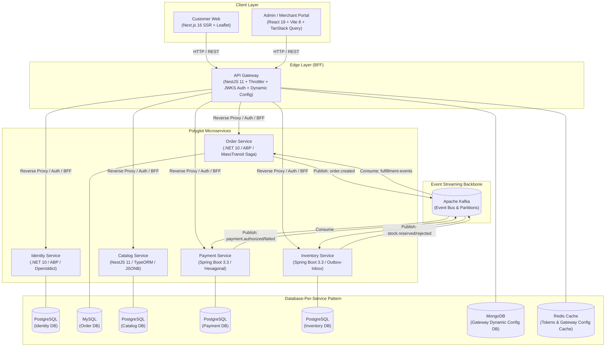
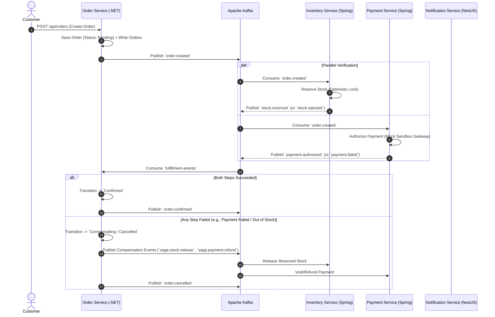

# 🍔 QuickBite — Polyglot Microservices Food Delivery Platform

<p align="center">
  
  
  
  
  
  
  
  
  
  
  
</p>

---

## 📌 Executive Summary

**QuickBite** is an enterprise-grade, distributed food delivery & ordering platform engineered using a **Polyglot Microservices Architecture**. The system solves high-concurrency order processing, distributed transaction consistency, and real-time state synchronization through an **Event-Driven Architecture (EDA)** powered by **Apache Kafka**.

Designed strictly following **Domain-Driven Design (DDD)** and **Hexagonal (Ports & Adapters) Architecture**, QuickBite implements mission-critical distributed patterns including **Saga Orchestration (State Machine)**, **Transactional Outbox / Inbox**, and **Optimistic Locking** to guarantee zero data loss and idempotent processing under peak loads.

---

## 🏛️ Architectural Highlights & Engineering Decisions

### 1. Polyglot Strategy & Domain Alignment
Rather than forcing a single language across diverse business capabilities, technology stacks were selected based on domain-specific requirements:

| Technology Stack | Core Strength | Assigned Domain & Services | Database | Rationale |
|---|---|---|---|---|
| **C# / .NET 10 (ABP Framework)** | Robust DDD building blocks, OpenIddict OIDC | **Identity Service** | PostgreSQL | Centralized identity authority, multi-tenancy, OAuth2/OIDC token issuance. |
| **C# / .NET 10 (ABP Framework)** | MassTransit State Machine, resilient outbox/inbox | **Order Service** | **MySQL** | High-performance transactional ACID storage, complex state machine orchestration for the order lifecycle. |
| **Java 21 / Spring Boot 3.3** | JVM financial ecosystem, Hexagonal Architecture | **Payment Service** | PostgreSQL | Strict financial transactions, compensation rollbacks, and mock sandbox payment gateway. |
| **Java 21 / Spring Boot 3.3** | High-throughput inventory hold, Outbox/Inbox ledger | **Inventory Service** | PostgreSQL | High-contention stock reservation with race-condition prevention and automated release on failure. |
| **Node.js / NestJS 11** | Non-blocking asynchronous I/O, dynamic JSON handling | **Catalog Service** | PostgreSQL | Fast menu searches, flexible JSONB requests workflow, and verified reviews. |
| **Node.js / NestJS 11** | Edge routing, Rate Limiting, 3-tier dynamic config | **API Gateway (BFF)** | Redis + MongoDB | Unified entry point, JWKS validation at edge, throttler, and BFF aggregation for admin/merchant. |
| **Next.js 16 + React 19** | SSR, Leaflet GPS Tracking, Tailwind v4, Zustand | **Customer Web App** | - | Lightning-fast storefront, SEO optimization, and live delivery map tracking. |
| **React 19 + Vite 8** | Instant HMR, TanStack Query 5, Recharts 3 | **Admin & Merchant Portal** | - | Highly responsive operations dashboard, menu designer, live order triage, and analytics. |

---

### 2. Core Distributed Systems Patterns



---

## 🔄 Distributed Saga & Transaction Management

The system employs an **Orchestration Saga** implemented with **MassTransit State Machine** in the Order Service to maintain eventual consistency across isolated microservices without distributed locks:



### 🛡️ Reliability Guarantees: Outbox & Inbox Patterns
* **Transactional Outbox:** Domain modifications and outgoing event records (`OutboxMessage`) are committed in the **same atomic database transaction**. A resilient background worker publishes messages to Kafka, eliminating the dual-write problem.
* **Idempotent Consumer (Inbox Pattern):** Kafka's *at-least-once* delivery model is countered with an `InboxMessage` ledger deduplicating events by unique `eventId`.
* **Optimistic Locking:** Inventory entities utilize JPA `@Version` timestamps to handle concurrent checkout spikes without blocking database threads.

---

## 🧩 Services Deep-Dive & Responsibilities

```
QuickBite/
├── src/
│   ├── quick-bite-identity/       # IAM, RBAC, OAuth2/OIDC, Multi-tenancy (.NET 10 / ABP 10 / PostgreSQL)
│   ├── quick-bite-order/          # Order lifecycle, Saga Orchestrator (.NET 10 / ABP 10 / MassTransit / MySQL)
│   ├── quick-bite-payment/        # Payment processing, Hexagonal Ports & Adapters (Spring Boot 3.3 / PostgreSQL)
│   ├── quick-bite-inventory/      # Stock reservation, Outbox/Inbox ledger (Spring Boot 3.3 / PostgreSQL)
│   ├── quick-bite-catalog/        # Restaurants, Food Items, Dynamic Request JSONB (NestJS 11 / PostgreSQL)
│   ├── quick-bite-api-gateway/    # Unified Edge Gateway, JWKS validation, Rate Limiting (NestJS 11 / Redis & Mongo)
│   ├── quick-bite-customer-web/   # Customer Portal, SSR, Leaflet GPS Tracking (Next.js 16 / React 19)
│   └── quick-bite-admin-portal/   # Merchant/Admin Operations Dashboard (React 19 / Vite 8 / TanStack Query 5)
```

### 1. Identity Service (`.NET 10` / `ABP Framework 10` / `PostgreSQL`)
* **Core Role:** Centralized authentication authority and IAM provider.
* **Security & Tokens:** Integrated **OpenIddict 7.2** implementing OAuth2 / OpenID Connect (OIDC), issuance of signed RS256 JWT tokens, JWKS discovery endpoint (`/.well-known/jwks.json`).
* **Key Features:** Multi-tenancy isolation, fine-grained Role-Based Access Control (RBAC), Redis-cached permission checks.

### 2. Order Service (`.NET 10` / `ABP Framework 10` / `MySQL`)
* **Core Role:** Core business aggregate and distributed **Saga Orchestrator**.
* **Storage:** Dedicated **MySQL** database (`Volo.Abp.EntityFrameworkCore.MySQL 10.0.0`).
* **Domain Model:** DDD Aggregate Root (`Order`), Entities (`OrderItem`), Value Objects (`Money`, `Address`, `OrderStatus`).
* **Saga Engine:** MassTransit State Machine managing complex asynchronous transitions: `Pending` ➔ `WaitingStock` ➔ `WaitingPayment` ➔ `Confirmed` ➔ `Delivering` ➔ `Completed` (with automatic compensation on failure).
* **Reliability:** Background workers (`InboxCleanupWorker`) and Outbox/Inbox tables for at-least-once Kafka event processing.

### 3. Payment Service (`Java 21` / `Spring Boot 3.3` / `PostgreSQL`)
* **Core Role:** Secure transaction processing, payment authorization, and settlement.
* **Hexagonal Architecture:** Strict separation between core Domain, Use Cases, Ports (`PaymentGatewayPort`), and Adapters (`MockPaymentAdapter`, `KafkaConsumer`, `JPA Repository`).
* **Mock Sandbox Gateway:** Integrated simulation interface allowing end-to-end demonstration of success/failure authorization scenarios.

### 4. Inventory Service (`Java 21` / `Spring Boot 3.3` / `PostgreSQL`)
* **Core Role:** Material & SKU stock management and transactional holds.
* **Concurrency Guard:** JPA `@Version` **Optimistic Locking** ensuring zero over-selling during peak concurrent orders.
* **Compensation Support:** Handles `stock.release` triggers to automatically restock items when upstream order phases abort.

### 5. Catalog Service (`NestJS 11` / `TypeORM` / `PostgreSQL`)
* **Core Role:** Restaurant profiles, categories, food items, modifiers, and verified review aggregations.
* **Generic Request Processing (JSONB):** Flexible review and registration workflows (`catalog_requests`) with ACID transactions for auto-onboarding approved restaurant merchants.
* **Anti-Spam Controls:** Compound unique indices `(orderId, foodItemId)` to enforce authentic, non-duplicate review submissions.

### 6. API Gateway / BFF (`NestJS 11` / `Redis` & `MongoDB`)
* **Core Role:** Single entry-point, edge authorization, aggregation, and request routing.
* **Edge Functions:** In-flight JWT/JWKS verification, `@nestjs/throttler` rate limiting, distributed correlation tracing (`x-correlation-id`), response shape normalization.
* **Resilient Dynamic Config:** 3-tier fallback configuration engine (`Redis Cache` ➔ `MongoDB Dynamic Config` ➔ `.env Local Fallback`).
* **System Wake-up / Cold-Start Trigger:** Fan-out health probe endpoint (`GET /api/system/health/wake-up`) designed for serverless or free-tier sleep cycles.

### 7. Customer Web App (`Next.js 16` / `React 19`)
* **Core Role:** Public-facing e-commerce storefront.
* **Performance & SEO:** React Server Components (RSC) for instantaneous server rendering and optimized open-graph indexing.
* **Live GPS Tracking:** Leaflet 1.9 & React Leaflet 5 for interactive delivery route tracking on order detail pages (`/order/[orderId]`).

### 8. Admin & Merchant Portal (`React 19` / `Vite 8` / `TanStack Query 5`)
* **Core Role:** Internal merchant POS and administration control center.
* **Capabilities:** Real-time order triage, menu designer, inventory adjustments, dynamic request approvals, and analytical revenue dashboards using Recharts 3.
* **Resilient Client:** Axios Interceptor with automatic queue management for silent token refreshes.

---

## 📡 Event-Driven Communication & Kafka Topics

The system follows a strict maximum 5-topic rule with partitioned event distribution:

| Kafka Topic | Partition Key | Producing Services | Consuming Services | Key Event Types |
|---|---|---|---|---|
| `order-events` | `orderId` | Order Service | Payment, Inventory, Notification | `order.created`, `order.confirmed`, `order.cancelled` |
| `fulfillment-events` | `orderId` | Payment, Inventory | Order Service (Saga) | `payment.authorized`, `payment.failed`, `stock.reserved`, `stock.rejected` |
| `catalog-events` | `restaurantId` | Catalog Service | Order, Customer Web | `menu.updated`, `restaurant.status.changed` |
| `notification-events`| `userId` | All Services | Notification Service | `notification.created`, `notification.sent` |

### Standardized Event Envelope Schema
All domain events follow a contract-first schema definition:
```json
{
  "eventId": "f47ac10b-58cc-4372-a567-0e02b2c3d479",
  "eventType": "order.created",
  "version": 1,
  "occurredAt": "2026-08-22T10:00:00Z",
  "tenantId": "tenant-default",
  "correlationId": "c8b82e9b-0012-4c6e-8219-4bb426ef16d1",
  "payload": {
    "orderId": "ORD-98421",
    "customerId": "CUST-1029",
    "restaurantId": "REST-001",
    "totalAmount": 250000,
    "currency": "VND",
    "items": [
      { "sku": "BURGER-BEEF-01", "quantity": 2, "unitPrice": 125000 }
    ]
  }
}
```

---

## 🌐 Uniform API Specification

All microservices (routed through the API Gateway) communicate via a standard JSON Response Envelope:

### Success Response (`2xx`)
```json
{
  "success": true,
  "statusCode": 200,
  "message": "Resource fetched successfully.",
  "data": { ... },
  "timestamp": "2026-08-22T10:30:00.000Z",
  "path": "/api/catalog/restaurants/9b1deb4d-3b7d-4bad-9bdd-2b0d7b3dcb6d"
}
```

### Error Response (`4xx / 5xx`)
```json
{
  "success": false,
  "statusCode": 404,
  "message": "Entity not found.",
  "errors": null,
  "timestamp": "2026-08-22T10:30:05.000Z",
  "path": "/api/catalog/restaurants/invalid-id"
}
```

---

## 🚀 Cold-Start Mitigation: Animated System Wake-up

In cloud environments with sleep/scale-to-zero tiers, the frontend integrates a dedicated `<BootScreen />` component utilizing **Anime.js**:
* **Topology Visualization:** Renders an animated SVG graph connecting the API Gateway to all downstream microservices.
* **Real-time Status Polling:** Triggers `GET /api/system/health/wake-up` which fans out health pings to `.NET`, `Spring Boot`, and `NestJS` instances.
* **Visual Glow Feedback:** Nodes dynamically transition from idle pulses to glowing green as each microservice signals HTTP 200 readiness before unmounting the boot screen.

---

## 🛠️ Local Development & Quick Start

### Prerequisites
* **Docker & Docker Compose** (v24+)
* **.NET 10 / 9 SDK**
* **Java 21 JDK** & **Maven 3.9+**
* **Node.js 20+** & **npm**

### 1. Clone & Setup Infrastructure
```bash
# Clone the repository
git clone https://github.com/ayana0409/QuickBite.git
cd QuickBite

# Start Core Infrastructure (Kafka, PostgreSQL, MySQL, Redis, MongoDB, Zookeeper)
docker compose -f infra/docker-compose.yml up -d
```

### 2. Run Backend Microservices
```bash
# Terminal 1 - API Gateway (NestJS - Port 3001)
cd src/quick-bite-api-gateway && npm install && npm run start:dev

# Terminal 2 - Catalog Service (NestJS - Port 3000)
cd src/quick-bite-catalog && npm install && npm run start:dev

# Terminal 3 - Identity Service (.NET 10 - Port 44391)
cd src/quick-bite-identity/QuickBite.Identity/src/QuickBite.Identity.HttpApi.Host
dotnet run

# Terminal 4 - Order Service (.NET 10 - Port 44386)
cd src/quick-bite-order/QuickBite.Order/src/QuickBite.Order.HttpApi.Host
dotnet run

# Terminal 5 - Payment Service (Spring Boot - Port 8084)
cd src/quick-bite-payment && ./mvnw spring-boot:run

# Terminal 6 - Inventory Service (Spring Boot - Port 8083)
cd src/quick-bite-inventory && ./mvnw spring-boot:run
```

### 3. Run Frontend Applications
```bash
# Terminal 7 - Customer Web (Next.js 16 - Port 3002)
cd src/quick-bite-customer-web && npm install && npm run dev
# -> Runs at http://localhost:3002

# Terminal 8 - Admin / Merchant Portal (React 19 + Vite 8 - Port 5173)
cd src/quick-bite-admin-portal && npm install && npm run dev
# -> Runs at http://localhost:5173
```

---

## 📈 Cross-Cutting Concerns & Observability

| Concern | Implementation Strategy |
|---|---|
| **Distributed Tracing** | OpenTelemetry SDK integration passing `x-correlation-id` across HTTP headers and Kafka metadata. |
| **Circuit Breakers & Retry** | Resilience4j (Spring Boot) & Polly (.NET) with Dead-Letter Topic (DLQ) routing for unprocessable events. |
| **Centralized Logging** | Serilog (.NET), Winston (NestJS), and Logback (Spring Boot) with structured JSON outputs. |
| **Authentication & AuthZ** | Asymmetric RS256 JWT validation using Identity Service JWKS endpoint at Edge Gateway. |

---

## 👨‍💻 Author & Architecture Portfolio

This repository demonstrates enterprise architecture principles, polyglot software design, and distributed systems engineering.

* **GitHub:** [@ayana0409](https://github.com/ayana0409)
* **Project Status:** Active Architecture Portfolio

---
<p align="center">Made with ❤️ for Scalable, Distributed Systems Engineering.</p>
