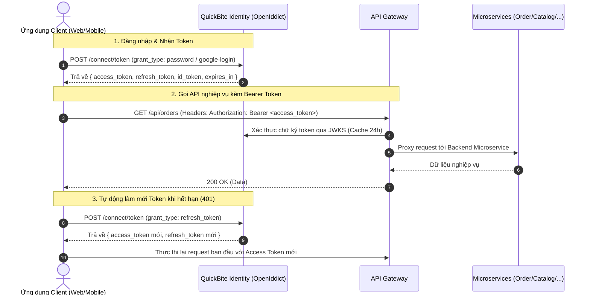

# 🔐 Hướng Dẫn Tích Hợp SSO Identity Server — QuickBite

Tài liệu này cung cấp hướng dẫn kỹ thuật chi tiết, đầy đủ và chuẩn xác nhất để tích hợp hệ thống **Single Sign-On (SSO)** của **QuickBite** (dựa trên **ABP Framework** & **OpenIddict**) vào bất kỳ dự án nào (React/Vue/Angular Web App, Mobile Flutter/React Native, hoặc Backend Resource Servers như NestJS, Spring Boot, .NET).

---

## 📑 Mục Lục
1. [Tổng Quan Kiến Trúc SSO](#1-tổng-quan-kiến-trúc-sso)
2. [Thông Tin Kết Nối & Biến Môi Trường](#2-thông-tin-kết-nối--biến-môi-trường)
3. [Chi Tiết Các Luồng Xác Thực (Authentication Flows)](#3-chi-tiết-các-luồng-xác-thực-authentication-flows)
   - [3.1. Đăng nhập bằng Tài khoản/Mật khẩu (Password Grant)](#31-đăng-nhập-bằng-tài-khoảnmật-khẩu-password-grant)
   - [3.2. Đăng nhập bằng Google (Google OAuth Exchange)](#32-đăng-nhập-bằng-google-google-oauth-exchange)
   - [3.3. Tự động làm mới Token (Refresh Token Grant)](#33-tự-động-làm-mới-token-refresh-token-grant)
   - [3.4. Lấy thông tin tài khoản (User Info Endpoint)](#34-lấy-thông-tin-tài-khoản-user-info-endpoint)
   - [3.5. Đăng xuất (Logout Flow)](#35-đăng-xuất-logout-flow)
4. [Cấu Trúc JWT Token & Ma Trận Phân Quyền (RBAC)](#4-cấu-trúc-jwt-token--ma-trận-phân-quyền-rbac)
5. [Mẫu Code Tích Hợp Frontend (TypeScript / React)](#5-mẫu-code-tích-hợp-frontend-typescript--react)
   - [5.1. Module Auth Service (`authService.ts`)](#51-module-auth-service-authservicets)
   - [5.2. Zustand Auth Store với LocalStorage Persistence](#52-zustand-auth-store-với-localstorage-persistence)
   - [5.3. Axios Client với Silent Refresh Mutex Queue](#53-axios-client-với-silent-refresh-mutex-queue)
   - [5.4. Route Guard & Hằng số phân quyền](#54-route-guard--hằng-số-phân-quyền)
6. [Mẫu Xác Thực Token Ở Tầng Backend (Resource Server Validation)](#6-mẫu-xác-thực-token-ở-tầng-backend-resource-server-validation)
   - [6.1. NestJS / Node.js (JWKS Verification)](#61-nestjs--nodejs-jwks-verification)
   - [.NET Core / C#](#62-net-core--c)
   - [Spring Boot / Java](#63-spring-boot--java)
7. [Bảng Mã Lỗi Thường Gặp & Khắc Phục](#7-bảng-mã-lỗi-thường-gặp--khắc-phục)

---

## 1. Tổng Quan Kiến Trúc SSO

Hệ thống QuickBite Identity Service đóng vai trò là **Authorization Server** tập trung, tuân thủ chuẩn **OAuth 2.0** và **OpenID Connect (OIDC)**.



---

## 2. Thông Tin Kết Nối & Biến Môi Trường

### 🌐 Endpoints Môi Trường

| Tên Môi Trường | Identity Service URL (SSO) | API Gateway URL |
| :--- | :--- | :--- |
| **Production / Cloud** | `https://quick-bite-identity.onrender.com` | `https://quick-bite-gw.onrender.com` |
| **Local Development** | `http://localhost:44391` | `http://localhost:3000` |

### ⚙️ Các Tham Số OIDC Chuẩn

```env
# URL SSO Identity Server
VITE_IDENTITY_SERVICE_URL=https://quick-bite-identity.onrender.com

# Client ID đăng ký trên OpenIddict
VITE_OIDC_CLIENT_ID=QuickBite_Portal

# Danh sách Scopes yêu cầu
VITE_OIDC_SCOPE=openid profile email roles offline_access Identity

# Google OAuth Client ID (Dành cho đăng nhập Google)
VITE_GOOGLE_CLIENT_ID=113578281242-7i60pmfrkot0cn8jel01p1t217m8ep51.apps.googleusercontent.com

# OpenID Discovery & JWKS (Dành cho Backend xác thực)
OIDC_DISCOVERY_URL=https://quick-bite-identity.onrender.com/.well-known/openid-configuration
JWKS_URI=https://quick-bite-identity.onrender.com/.well-known/jwks
```

---

## 3. Chi Tiết Các Luồng Xác Thực (Authentication Flows)

---

### 3.1. Đăng nhập bằng Tài khoản/Mật khẩu (Password Grant)

Cấp phát bộ đôi `access_token` và `refresh_token` khi người dùng nhập username/email và mật khẩu.

* **Endpoint:** `POST /connect/token`
* **Content-Type:** `application/x-www-form-urlencoded`
* **Authentication:** Không yêu cầu Client Secret đối với Public Client (`QuickBite_Portal`).

#### Request Parameters:
| Tham số | Kiểu | Bắt buộc | Giá trị mẫu | Mô tả |
| :--- | :--- | :---: | :--- | :--- |
| `grant_type` | `string` | **Có** | `password` | Loại cấp phép OAuth 2.0 |
| `client_id` | `string` | **Có** | `QuickBite_Portal` | Tên Client định danh |
| `scope` | `string` | **Có** | `openid profile email roles offline_access Identity` | Các quyền truy cập cần cấp |
| `username` | `string` | **Có** | `admin` hoặc `user@domain.com` | Tên đăng nhập hoặc Email |
| `password` | `string` | **Có** | `P@ssword123` | Mật khẩu tài khoản |

#### cURL Mẫu:
```bash
curl -X POST "https://quick-bite-identity.onrender.com/connect/token" \
  -H "Content-Type: application/x-www-form-urlencoded" \
  -d "grant_type=password" \
  -d "client_id=QuickBite_Portal" \
  -d "scope=openid profile email roles offline_access Identity" \
  -d "username=admin" \
  -d "password=Passw0rd@123"
```

#### Response Thành công (`200 OK`):
```json
{
  "access_token": "eyJhbGciOiJSUzI1NiIsInR5cCI6IkpXVCJ9...",
  "token_type": "Bearer",
  "expires_in": 3600,
  "refresh_token": "92f7c0f1-4870-4f51-b84e-2895d302a24f",
  "id_token": "eyJhbGciOiJSUzI1NiIsInR5cCI6IkpXVCJ9...",
  "scope": "openid profile email roles offline_access Identity"
}
```

---

### 3.2. Đăng nhập bằng Google (Google OAuth Exchange)

Dành cho frontend lấy Google `id_token` từ `@react-oauth/google` và gửi lên Identity Service để tự động tạo tài khoản / đăng nhập và nhận JWT token của hệ thống QuickBite.

* **Endpoint:** `POST /api/app/auth/google-login`
* **Content-Type:** `application/json`

#### Request Body:
```json
{
  "idToken": "eyJhbGciOiJSUzI1NiIsImtpZCI6Ij..."
}
```

#### cURL Mẫu:
```bash
curl -X POST "https://quick-bite-identity.onrender.com/api/app/auth/google-login" \
  -H "Content-Type: application/json" \
  -d '{"idToken": "eyJhbGciOiJSUzI1NiIsImtpZCI6Ij..."}'
```

#### Response Thành công (`200 OK`):
```json
{
  "access_token": "eyJhbGciOiJSUzI1NiIs...",
  "token_type": "Bearer",
  "expires_in": 3600,
  "refresh_token": "63a9b1c2-3e4f-5678-abcd-9012345678ef",
  "id_token": "eyJhbGciOiJSUzI1NiIs..."
}
```

---

### 3.3. Tự động làm mới Token (Refresh Token Grant)

Khi `access_token` hết hạn (hoặc khi nhận mã lỗi `401 Unauthorized` từ API Gateway), sử dụng `refresh_token` để cấp mới `access_token` mà không làm gián đoạn trải nghiệm người dùng.

* **Endpoint:** `POST /connect/token`
* **Content-Type:** `application/x-www-form-urlencoded`

#### Request Parameters:
| Tham số | Kiểu | Bắt buộc | Giá trị mẫu | Mô tả |
| :--- | :--- | :---: | :--- | :--- |
| `grant_type` | `string` | **Có** | `refresh_token` | Cấp phép bằng Refresh Token |
| `client_id` | `string` | **Có** | `QuickBite_Portal` | Tên Client định danh |
| `refresh_token` | `string` | **Có** | `92f7c0f1-4870-4f51-b84e-2895d302a24f` | Refresh Token hiện tại |
| `scope` | `string` | **Có** | `openid profile email roles offline_access Identity` | Danh sách scopes |

#### cURL Mẫu:
```bash
curl -X POST "https://quick-bite-identity.onrender.com/connect/token" \
  -H "Content-Type: application/x-www-form-urlencoded" \
  -d "grant_type=refresh_token" \
  -d "client_id=QuickBite_Portal" \
  -d "refresh_token=92f7c0f1-4870-4f51-b84e-2895d302a24f" \
  -d "scope=openid profile email roles offline_access Identity"
```

#### Response Thành công (`200 OK`):
```json
{
  "access_token": "eyJhbGciOiJSUzI1NiIsInR5cCI6IkpXVCJ9...new_token",
  "token_type": "Bearer",
  "expires_in": 3600,
  "refresh_token": "3fa85f64-5717-4562-b3fc-2c963f66afa6"
}
```

---

### 3.4. Lấy thông tin tài khoản (User Info Endpoint)

* **Endpoint:** `GET /connect/userinfo`
* **Headers:** `Authorization: Bearer <access_token>`

#### Response (`200 OK`):
```json
{
  "sub": "3a2301f8-d287-b1c0-5279-44e8d32753dd",
  "name": "Admin User",
  "given_name": "Admin",
  "family_name": "QuickBite",
  "preferred_username": "admin",
  "email": "admin@quickbite.vn",
  "email_verified": true,
  "role": ["admin", "quickbite-admin"]
}
```

---

### 3.5. Đăng xuất (Logout Flow)

1. Xóa toàn bộ token (`accessToken`, `refreshToken`, `idToken`) khỏi local storage / state store.
2. Xóa Authorization header khỏi HTTP Client instance.
3. Chuyển hướng người dùng về trang đăng nhập `/login`.

---

## 4. Cấu Trúc JWT Token & Ma Trận Phân Quyền (RBAC)

### 🧩 Cấu trúc Claims trong `access_token`

Khi decode token JWT, payload chứa các thông tin sau:

```json
{
  "iss": "https://quick-bite-identity.onrender.com",
  "sub": "3a2301f8-d287-b1c0-5279-44e8d32753dd",
  "unique_name": "subadmin",
  "preferred_username": "subadmin",
  "email": "subadmin@quickbite.vn",
  "role": [
    "sub-admin",
    "quickbite-sub-admin"
  ],
  "permissions": [
    "AbpIdentity.Users",
    "Order.Orders.AdminView"
  ],
  "exp": 1724578800,
  "client_id": "QuickBite_Portal"
}
```

> [!IMPORTANT]
> **Quy tắc giải mã Role Claim:**
> - Trong một số token, `role` có thể là **chuỗi đơn** (ví dụ `"role": "admin"`) hoặc **mảng chuỗi** (`"role": ["admin", "quickbite-admin"]`).
> - Hoặc nằm trong claim tiêu chuẩn Microsoft: `http://schemas.microsoft.com/ws/2008/06/identity/claims/role`.
> - Do đó luôn cần chuẩn hóa: đưa về dạng mảng chữ thường (`lower-case`) và loại bỏ khoảng trắng.

### 🛡️ Ma Trận Phân Quyền Chi Tiết (Role Matrix)

| Nhóm Vai Trò | Danh Sách Role Hợp Lệ | Quyền Hạn Trong Hệ Thống |
| :--- | :--- | :--- |
| **Admin Group** | `admin`, `administrator`, `superadmin`, `system_admin`, `quickbite-admin` | **Toàn quyền:** Quản trị hệ thống, Quản lý tài khoản, Cấu hình động (`/admin/settings`). |
| **Sub-Admin Group** | `sub-admin`, `subadmin`, `sub_admin`, `quickbite-sub-admin` | **Vận hành & Quản lý người dùng:** Quản lý nhà hàng, đơn hàng, duyệt danh mục, xử lý yêu cầu, **Quản lý tài khoản** (`/admin/users`). *Bị chặn cấu hình hệ thống.* |
| **Manager Group** | `manager`, `quickbite-manager` | **Vận hành cơ bản:** Xem Dashboard, Báo cáo thống kê, Quán ăn, Đơn hàng. *Bị chặn Quản lý tài khoản và Cấu hình hệ thống.* |
| **Merchant Group** | `merchant`, `seller`, `restaurant`, `quickbite-merchant` | **Cổng đối tác Nhà hàng:** Quản lý menu, món ăn, tồn kho, doanh thu, đơn hàng quán (`/merchant/*`). |
| **Customer Group** | User không có role đặc biệt | **Ứng dụng Khách hàng:** Đặt món, theo dõi đơn hàng trên Mobile App / Web App khách hàng. |

---

## 5. Mẫu Code Tích Hợp Frontend (TypeScript / React)

Dưới đây là mã nguồn hoàn chỉnh chuẩn Production để bạn copy trực tiếp vào dự án mới.

---

### 5.1. Module Hằng Số & Hàm Tiện Ích (`src/constants/roles.ts`)

```typescript
/**
 * src/constants/roles.ts
 * Centralized Role Constants and Helper Functions
 */

export const ADMIN_ROLES = [
  'admin',
  'administrator',
  'superadmin',
  'system_admin',
  'quickbite-admin',
] as const;

export const SUB_ADMIN_ROLES = [
  'sub-admin',
  'subadmin',
  'sub_admin',
  'quickbite-sub-admin',
] as const;

export const MANAGER_ROLES = [
  'manager',
  'quickbite-manager',
] as const;

export const MERCHANT_ROLES = [
  'merchant',
  'seller',
  'restaurant',
  'quickbite-merchant',
] as const;

export const ADMIN_PORTAL_ROLES = [
  ...ADMIN_ROLES,
  ...SUB_ADMIN_ROLES,
  ...MANAGER_ROLES,
] as const;

export const USER_MANAGEMENT_ROLES = [
  ...ADMIN_ROLES,
  ...SUB_ADMIN_ROLES,
] as const;

export const SYSTEM_CONFIG_ROLES = [
  ...ADMIN_ROLES,
] as const;

export function getUserRoles(user: { role?: string; roles?: string[] } | null | undefined): string[] {
  if (!user) return [];
  const rawRoles = user.roles && user.roles.length > 0 ? user.roles : (user.role ? [user.role] : []);
  return rawRoles.map((r) => String(r).toLowerCase().trim()).filter(Boolean);
}

export function hasRoleMatch(userRoles: string[], targetRoles: readonly string[]): boolean {
  return targetRoles.some((target) => userRoles.includes(target.toLowerCase()));
}

export function canAccessAdminPortal(user: { role?: string; roles?: string[] } | null | undefined): boolean {
  return hasRoleMatch(getUserRoles(user), ADMIN_PORTAL_ROLES);
}

export function canManageUsers(user: { role?: string; roles?: string[] } | null | undefined): boolean {
  return hasRoleMatch(getUserRoles(user), USER_MANAGEMENT_ROLES);
}

export function canAccessSystemConfig(user: { role?: string; roles?: string[] } | null | undefined): boolean {
  return hasRoleMatch(getUserRoles(user), SYSTEM_CONFIG_ROLES);
}

export function isMerchant(user: { role?: string; roles?: string[] } | null | undefined): boolean {
  return hasRoleMatch(getUserRoles(user), MERCHANT_ROLES);
}
```

---

### 5.2. Module Auth Service (`src/services/authService.ts`)

```typescript
/**
 * src/services/authService.ts
 * Single Sign-On Authentication Service
 */
import axios from 'axios';
import { useAuthStore } from '../stores/authStore';

const identityBaseUrl = import.meta.env.VITE_IDENTITY_SERVICE_URL || 'https://quick-bite-identity.onrender.com';

const identityClient = axios.create({
  baseURL: identityBaseUrl,
  headers: {
    'Content-Type': 'application/x-www-form-urlencoded',
  },
  timeout: 30000,
});

export function parseJwt<T = any>(token: string): T | null {
  try {
    const base64Url = token.split('.')[1];
    if (!base64Url) return null;
    const base64 = base64Url.replace(/-/g, '+').replace(/_/g, '/');
    const jsonPayload = decodeURIComponent(
      atob(base64)
        .split('')
        .map((c) => '%' + ('00' + c.charCodeAt(0).toString(16)).slice(-2))
        .join('')
    );
    return JSON.parse(jsonPayload) as T;
  } catch {
    return null;
  }
}

export function extractUserFromClaims(claims: any) {
  const rawRole =
    claims.role ||
    claims.roles ||
    claims['http://schemas.microsoft.com/ws/2008/06/identity/claims/role'] ||
    [];

  let rolesList: string[] = [];
  if (Array.isArray(rawRole)) {
    rolesList = rawRole.map((r) => String(r).trim()).filter(Boolean);
  } else if (typeof rawRole === 'string' && rawRole.trim()) {
    try {
      const parsed = JSON.parse(rawRole);
      rolesList = Array.isArray(parsed) ? parsed.map((r) => String(r).trim()) : [rawRole.trim()];
    } catch {
      rolesList = rawRole.split(/[,\s]+/).map((r) => r.trim()).filter(Boolean);
    }
  }

  const username = claims.preferred_username || claims.given_name || claims.sub || 'User';
  const email = claims.email || `${username}@quickbite.internal`;
  const fullName = claims.given_name || claims.name || username;

  return {
    id: claims.sub || 'unknown-id',
    email,
    username,
    fullName,
    role: rolesList[0],
    roles: rolesList,
    permissions: claims.permissions || [],
  };
}

export async function loginUser(credentials: { username: string; password: string }) {
  const params = new URLSearchParams();
  params.append('grant_type', 'password');
  params.append('client_id', import.meta.env.VITE_OIDC_CLIENT_ID || 'QuickBite_Portal');
  params.append('scope', import.meta.env.VITE_OIDC_SCOPE || 'openid profile email roles offline_access Identity');
  params.append('username', credentials.username);
  params.append('password', credentials.password);

  const res = await identityClient.post('/connect/token', params);
  const { access_token, refresh_token, id_token } = res.data;

  const claims = parseJwt(access_token) || parseJwt(id_token || '');
  const user = extractUserFromClaims(claims);

  useAuthStore.getState().setAuth(user, access_token, refresh_token, id_token);
  return user;
}

export async function loginWithGoogle(idToken: string) {
  const res = await axios.post(`${identityBaseUrl}/api/app/auth/google-login`, { idToken });
  const { access_token, refresh_token, id_token } = res.data;

  const claims = parseJwt(access_token) || parseJwt(id_token || '');
  const user = extractUserFromClaims(claims);

  useAuthStore.getState().setAuth(user, access_token, refresh_token, id_token);
  return user;
}

export async function refreshAccessToken(): Promise<{ accessToken: string; refreshToken?: string }> {
  const currentRefreshToken = useAuthStore.getState().refreshToken;
  if (!currentRefreshToken) {
    throw new Error('No refresh token available');
  }

  const params = new URLSearchParams();
  params.append('grant_type', 'refresh_token');
  params.append('client_id', import.meta.env.VITE_OIDC_CLIENT_ID || 'QuickBite_Portal');
  params.append('refresh_token', currentRefreshToken);
  params.append('scope', import.meta.env.VITE_OIDC_SCOPE || 'openid profile email roles offline_access Identity');

  const res = await identityClient.post('/connect/token', params);
  const newAccessToken = res.data.access_token;
  const newRefreshToken = res.data.refresh_token || currentRefreshToken;

  useAuthStore.getState().setTokens(newAccessToken, newRefreshToken);
  return { accessToken: newAccessToken, refreshToken: newRefreshToken };
}
```

---

### 5.3. Axios Client với Silent Refresh Mutex Queue (`src/services/axiosClient.ts`)

```typescript
/**
 * src/services/axiosClient.ts
 * Axios Client with Automatic Token Injection and Thread-safe 401 Refresh Queue
 */
import axios, { AxiosError, InternalAxiosRequestConfig, AxiosHeaders } from 'axios';
import { useAuthStore } from '../stores/authStore';
import { refreshAccessToken } from './authService';

let isRefreshing = false;
let failedQueue: Array<{
  resolve: (value?: any) => void;
  reject: (reason?: any) => void;
  config: InternalAxiosRequestConfig;
}> = [];

const processQueue = (error: Error | null, token: string | null = null) => {
  failedQueue.forEach((prom) => {
    if (error) {
      prom.reject(error);
    } else if (token) {
      if (!prom.config.headers) {
        prom.config.headers = new AxiosHeaders();
      }
      prom.config.headers.set('Authorization', `Bearer ${token}`);
      prom.resolve(axiosClient(prom.config));
    }
  });
  failedQueue = [];
};

export const axiosClient = axios.create({
  baseURL: import.meta.env.VITE_API_GATEWAY_URL || 'https://quick-bite-gw.onrender.com',
  headers: {
    'Content-Type': 'application/json',
  },
  timeout: 30000,
});

// 1. Request Interceptor: Tự động gán Bearer Token
axiosClient.interceptors.request.use((config) => {
  const token = useAuthStore.getState().accessToken;
  if (token) {
    if (!config.headers) config.headers = new AxiosHeaders();
    config.headers.set('Authorization', `Bearer ${token}`);
  }
  return config;
});

// 2. Response Interceptor: Bắt lỗi 401 và làm mới Token tự động
axiosClient.interceptors.response.use(
  (response) => response.data,
  async (error: AxiosError) => {
    const originalRequest = error.config as (InternalAxiosRequestConfig & { _retry?: boolean }) | undefined;

    if (error.response?.status === 401 && originalRequest && !originalRequest._retry) {
      const { refreshToken, logout } = useAuthStore.getState();

      if (!refreshToken) {
        logout();
        return Promise.reject(error);
      }

      if (isRefreshing) {
        return new Promise((resolve, reject) => {
          failedQueue.push({ resolve, reject, config: originalRequest });
        });
      }

      originalRequest._retry = true;
      isRefreshing = true;

      try {
        const { accessToken: newAccessToken } = await refreshAccessToken();
        processQueue(null, newAccessToken);

        if (!originalRequest.headers) originalRequest.headers = new AxiosHeaders();
        originalRequest.headers.set('Authorization', `Bearer ${newAccessToken}`);
        return axiosClient(originalRequest);
      } catch (refreshErr: any) {
        processQueue(refreshErr, null);
        logout();
        return Promise.reject(refreshErr);
      } finally {
        isRefreshing = false;
      }
    }

    return Promise.reject(error);
  }
);
```

---

## 6. Mẫu Xác Thực Token Ở Tầng Backend (Resource Server Validation)

Backend nhận token từ Frontend và cần xác minh tính hợp lệ mà **không cần hardcode Secret Key**, bằng cách tải Public Key động qua **JWKS (`/.well-known/jwks`)**.

---

### 6.1. NestJS / Node.js (JWKS Verification)

Cài đặt thư viện:
```bash
npm install passport passport-jwt jwks-rsa @nestjs/passport
```

Cấu hình Strategy `jwt.strategy.ts`:
```typescript
import { Injectable } from '@nestjs/common';
import { PassportStrategy } from '@nestjs/passport';
import { ExtractJwt, Strategy } from 'passport-jwt';
import { passportJwtSecret } from 'jwks-rsa';

@Injectable()
export class JwtStrategy extends PassportStrategy(Strategy, 'jwt') {
  constructor() {
    const identityUrl = process.env.IDENTITY_URL || 'https://quick-bite-identity.onrender.com';
    const jwksUri = `${identityUrl.replace(/\/$/, '')}/.well-known/jwks`;

    super({
      jwtFromRequest: ExtractJwt.fromAuthHeaderAsBearerToken(),
      ignoreExpiration: false,
      secretOrKeyProvider: passportJwtSecret({
        cache: true,
        rateLimit: true,
        jwksRequestsPerMinute: 5,
        jwksUri,
      }),
    });
  }

  validate(payload: any) {
    // Trả về payload được gắn trực tiếp vào req.user
    return payload;
  }
}
```

---

### 6.2. .NET Core / C# (`Program.cs`)

```csharp
builder.Services.AddAuthentication("Bearer")
    .AddJwtBearer("Bearer", options =>
    {
        options.Authority = "https://quick-bite-identity.onrender.com";
        options.RequireHttpsMetadata = true;
        options.TokenValidationParameters = new Microsoft.IdentityModel.Tokens.TokenValidationParameters
        {
            ValidateAudience = false,
            ValidateIssuer = true,
            ValidIssuer = "https://quick-bite-identity.onrender.com"
        };
    });

builder.Services.AddAuthorization();
```

---

### 6.3. Spring Boot / Java (`application.yml`)

```yaml
spring:
  security:
    oauth2:
      resourceserver:
        jwt:
          issuer-uri: https://quick-bite-identity.onrender.com
          jwk-set-uri: https://quick-bite-identity.onrender.com/.well-known/jwks
```

---

## 7. Bảng Mã Lỗi Thường Gặp & Khắc Phục

| Mã lỗi / Error Code | Nguyên nhân | Hướng khắc phục |
| :--- | :--- | :--- |
| `invalid_grant` | Tên đăng nhập hoặc mật khẩu không chính xác; hoặc Refresh Token đã hết hạn / bị thu hồi. | Kiểm tra lại credentials hoặc yêu cầu người dùng đăng nhập lại từ đầu. |
| `invalid_client` | Sai `client_id` (không khớp với cấu hình OpenIddict). | Đảm bảo gửi chính xác `client_id=QuickBite_Portal`. |
| `invalid_scope` | Scope yêu cầu không nằm trong danh sách được phép. | Sử dụng chuỗi scope chuẩn: `openid profile email roles offline_access Identity`. |
| `401 Unauthorized` | Access Token đã hết hạn hoặc không truyền header `Authorization`. | Kích hoạt luồng `grant_type=refresh_token` để đổi token mới. |
| `403 Forbidden` | Token hợp lệ nhưng Role của user không có quyền truy cập endpoint. | Kiểm tra lại Ma Trận Phân Quyền (RBAC) trong mục 4. |
| `JWKS fetch failed` | Backend không kết nối được tới `/.well-known/jwks` của Identity Service. | Kiểm tra kết nối mạng và biến môi trường `IDENTITY_URL`. |

---

> 💡 **Khuyến nghị triển khai:**
> Khi xây dựng Client mới (Mobile / Web), hãy tuân thủ cấu trúc lưu trữ và Interceptor ở **Mục 5** để được tự động hỗ trợ Refresh Token liên tục mà không bao giờ bị ngắt phiên đăng nhập giữa chừng!
